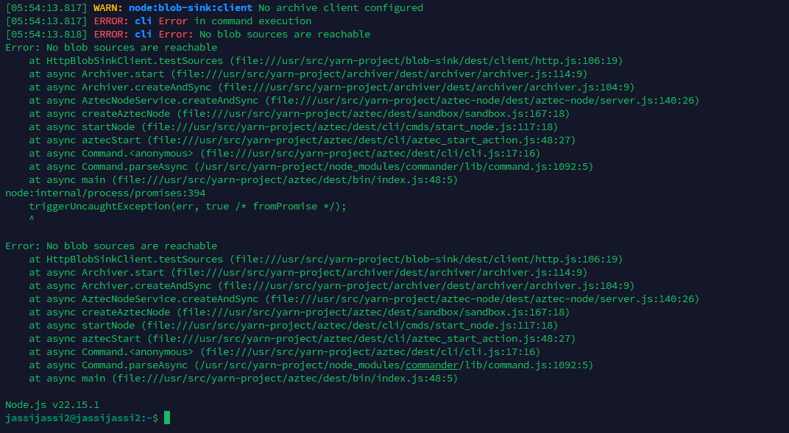
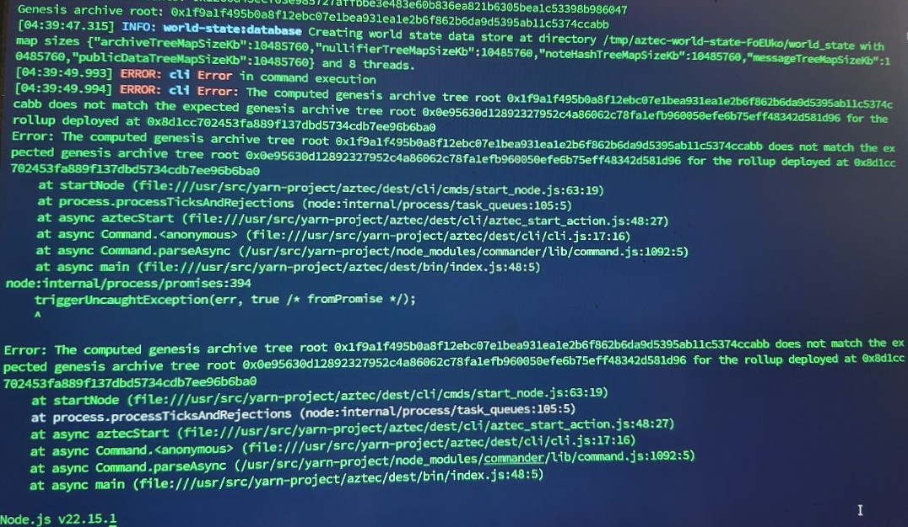
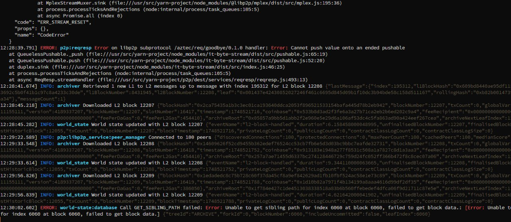
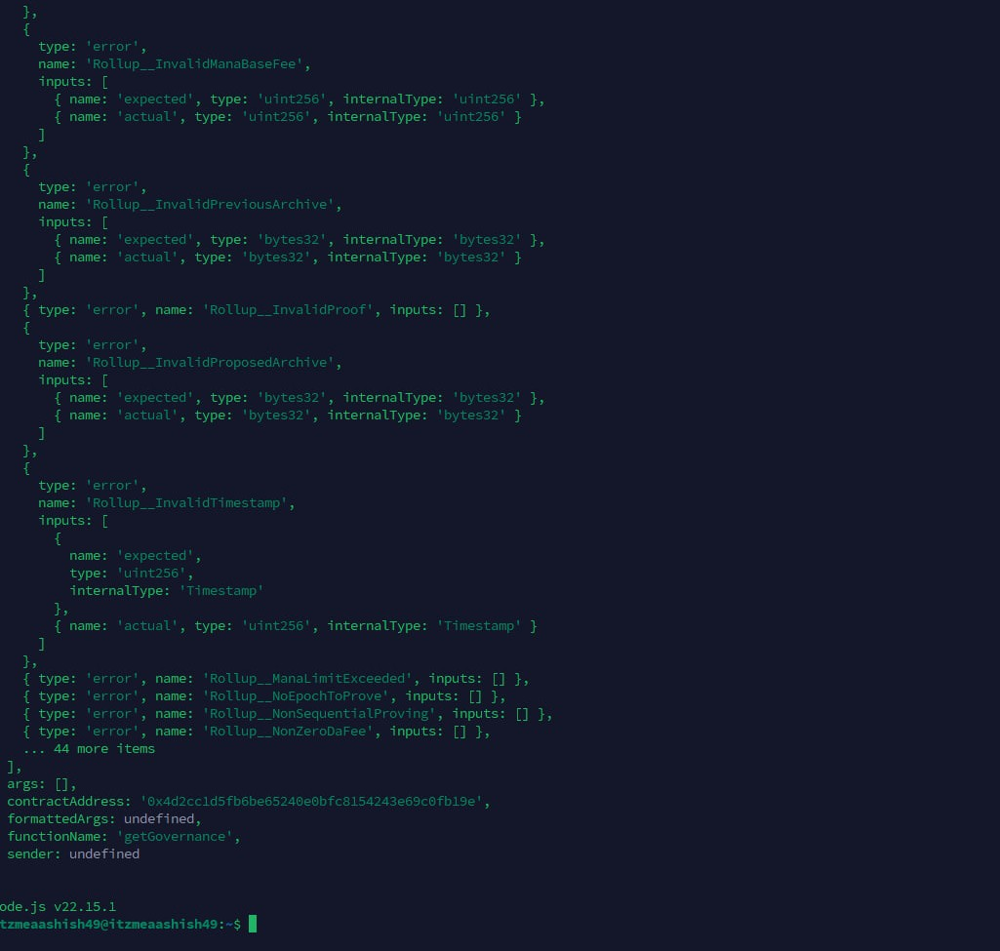

<h1 align="center">❓ FAQ & Troubleshooting</h1>


### 1. No Blob Sources Are Reachable



**Why:**  
Incorrect command format while starting the node.

**Solution:**  
Use the correct `aztec start` format:

```bash
aztec start --node --archiver --sequencer \
  --network alpha-testnet \
  --l1-rpc-urls <Eth_Sepolia_RPC> \
  --l1-consensus-host-urls <Beacon_Sepolia_RPC> \
  --sequencer.validatorPrivateKey 0x<Your_Private_Key> \
  --sequencer.coinbase <Your_EVM_Address> \
  --p2p.p2pIp <Your_IP>
```

**🔁 Replace Carefully:**

- `<Eth_Sepolia_RPC>` → Your actual Sepolia RPC
- `<Beacon_Sepolia_RPC>` → Your Beacon Sepolia RPC
- `0x<Your_Private_Key>` → EVM wallet private key (with `0x`)
- `<Your_EVM_Address>` → Funded Sepolia address (get from [Faucet](https://sepolia-faucet.pk910.de/))
- `<Your_IP>` → VPS IP (`curl ifconfig.me`)

Make sure all fields are valid — this will fix the "No Blob Sources" error.

---

### 2. TempData Issue



**Why:** Old temp data.

**Solution:**
```bash
aztec-up 0.85.0-alpha-testnet.9
```
_Then, Restart your node and it'll be fixed._

---

### 3. Error While Running



**Why:** Due To RPC load.

**Solution:**  
> ⚠️ Seeing some errors while syncing? Don't worry — it's normal **if blocks are syncing**.

> 🚫 Only errors and **no success blocks**? Try changing your RPC.


---

### 4. Undefined Error



---

## ❓ Why does this happen?

This error usually occurs due to **RPC** or **Port** issues. Your node or RPC endpoint might not be accessible because the required ports are not open or firewall rules are blocking the connection.

---

## 🛠️ Solution

### **A. If you created your own RPC**

1. **Open Required Ports on Both VPS (RPC & Node):**

    ```bash
    sudo ufw allow 30303/tcp && sudo ufw allow 30303/udp && sudo ufw allow 8545/tcp && sudo ufw allow 8546/tcp && sudo ufw allow 8551/tcp && sudo ufw allow 4000/tcp && sudo ufw allow 3500/tcp && sudo ufw enable && sudo ufw status
    ```

2. **Configure Google Cloud Firewall:**

    - Go to [Firewall Rules](https://console.cloud.google.com/networking/firewalls)
    - Click **Create Firewall Rule**
    - Fill in the following:

      | Field              | Value                                      |
      |--------------------|--------------------------------------------|
      | Name               | allow-rpc-access                           |
      | Network            | default (or your VPC name)                 |
      | Priority           | 1000                                       |
      | Direction          | Ingress                                    |
      | Action             | Allow                                      |
      | Targets            | Specified target tags                      |
      | Target tags        | allow-rpc                                  |
      | Source IP ranges   | 0.0.0.0/0                                  |
      | Protocols and ports| tcp:3500,4000,8545-8551,30303, udp:30303             |

    - Click **Create**

3. **Tag Your Instance:**

    - Go to [Compute Instances](https://console.cloud.google.com/compute/instances)
    - Click your VPS1 instance → **Edit**
    - Scroll to **Network tags** → add: `allow-rpc`
    - Click **Save**

4. **Try running your node again!**  
    _Your issue should be fixed._

---

### **B. If you bought the RPC and still face this issue**

1. **Open Required Ports:**

    ```bash
    sudo ufw allow 30303/tcp && sudo ufw allow 30303/udp && sudo ufw allow 8545/tcp && sudo ufw allow 8546/tcp && sudo ufw allow 8551/tcp && sudo ufw allow 4000/tcp && sudo ufw allow 3500/tcp && sudo ufw enable && sudo ufw status
    ```

2. **Try running your node again.**  
    _If it still doesn't work, try changing your RPC provider._

---
